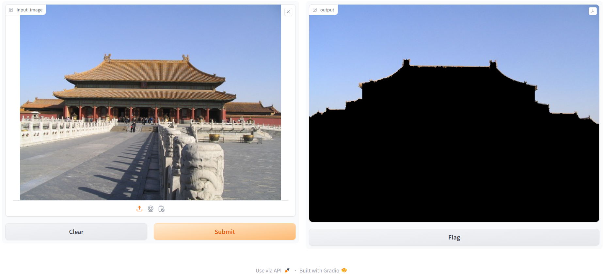
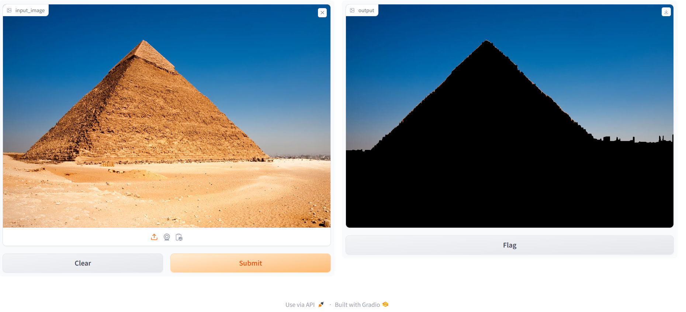
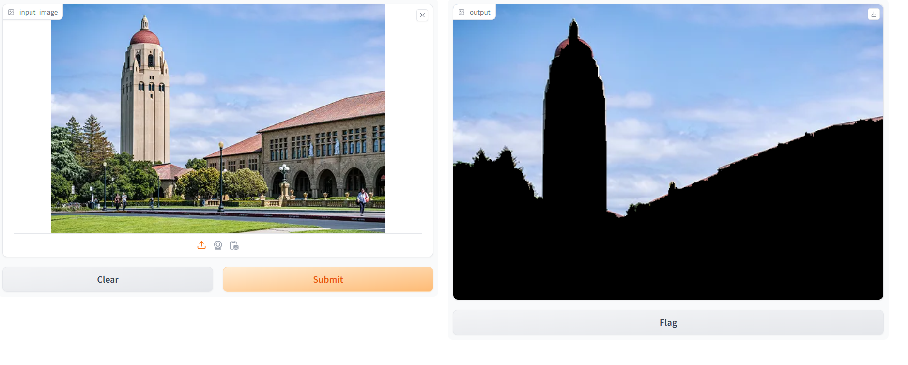
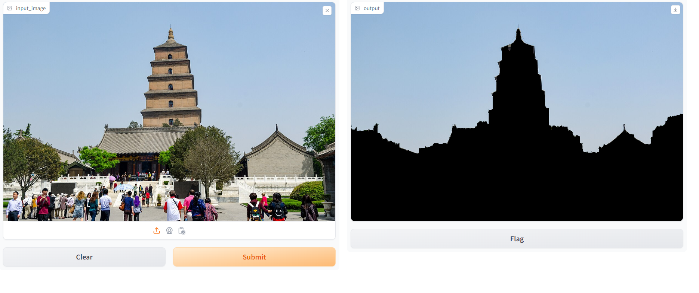
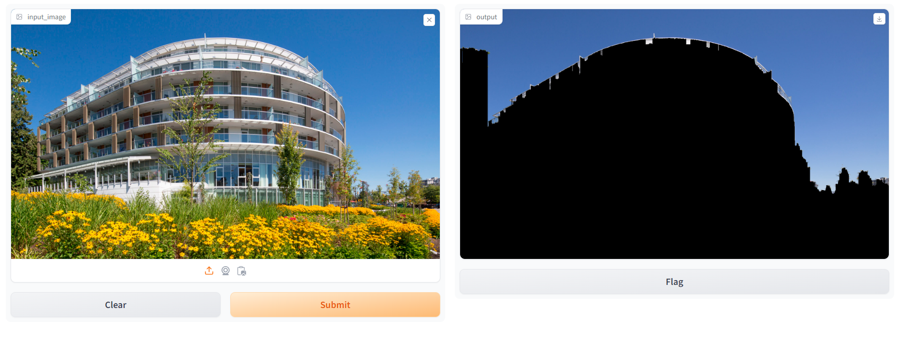
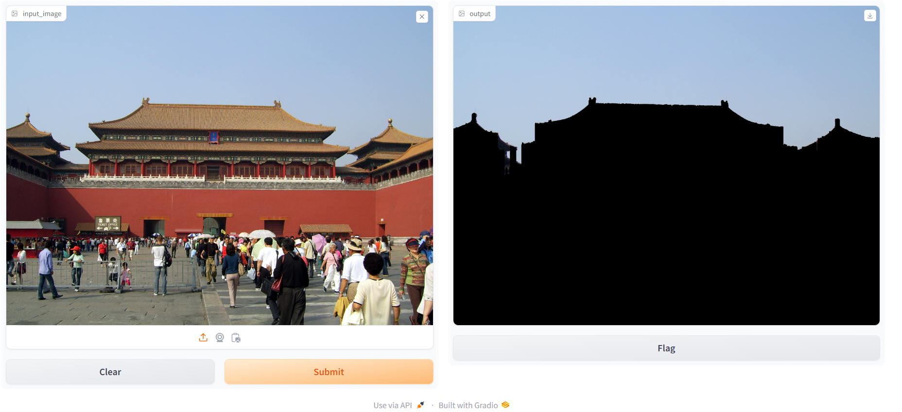
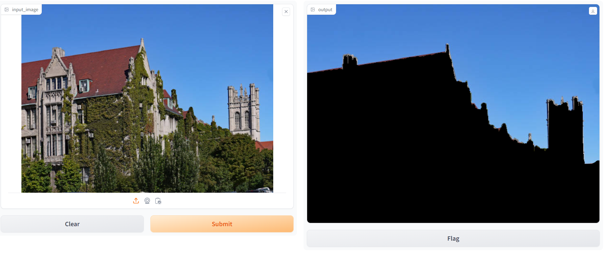
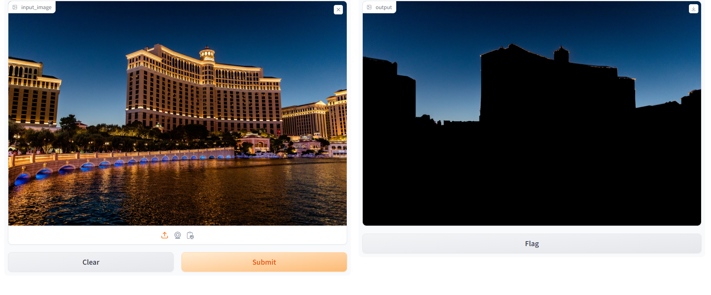

## Welcome to Gradio

1. **Import Your Picture**
- Locate the left box on the Gradio interface.
- Simply drag and drop your image into the left box or click to browse and select your picture.
- 

2. **Image Identification with Gradio**

After uploading your image, click on the "Submit" button. On the right side, you will observe the generated image highlighting the pixels corresponding to the sky. Non-sky areas will be concealed with black pixels, while the sky portion will be revealed. This process aids in the identification and differentiation of sky pixels, providing a clear visual representation of the sky in the output image.
- 

3. **Following that, a series of demonstrations will be presented**

- 
- 
- 
- 
- 
- 
- 
- 

You can observe that my algorithm is capable of identifying 99% of the sky; occasionally, there might be errors where buildings are mistakenly classified as sky. However, the accuracy consistently remains above 90%. 

My algorithm has several limitations:
- The algorithm may encounter limitations in accurately identifying sky regions in images with irregularly shaped architectural structures.
- Reflections on building surfaces might pose challenges for the algorithm, impacting its ability to distinguish the sky accurately.
- Instances where buildings have protruding elements such as poles may lead to difficulties in sky segmentation.
- The algorithm may face challenges in distinguishing between sky and water bodies, especially when lakes or bodies of water seamlessly blend with the sky due to similar color tones.
- Partial occlusion of the sky, whether by buildings or other objects, may compromise the accuracy of the segmentation process.
- The algorithm may struggle to differentiate between sky and extensive white cloud cover, potentially affecting the precision of the segmentation results.